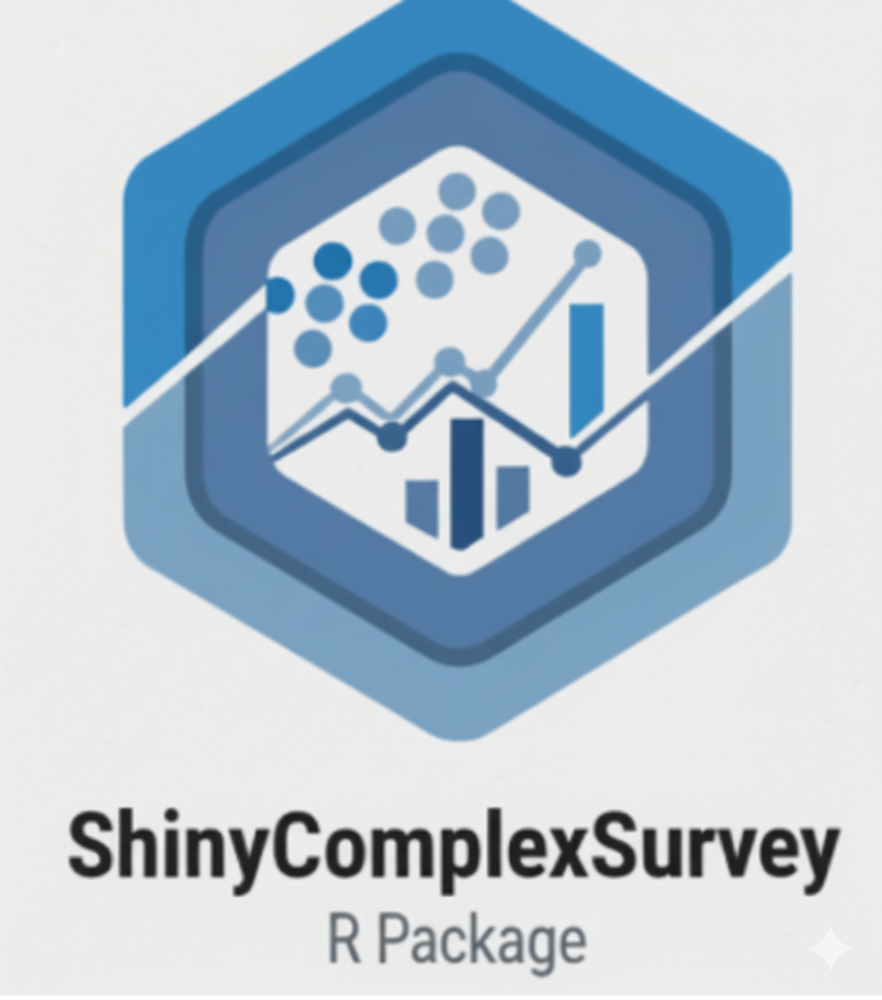

# ShinyComplexSurvey: Una aplicación Shiny para análisis de encuestas complejas 

**ShinyComplexSurvey** es una aplicación de `R Shiny` diseñada para simplificar el
análisis de datos de encuestas complejas. Permite a los usuarios explorar, 
analizar y visualizar datos de encuestas probabilísticas de manera intuitiva y
sin necesidad de escribir código, manejando automáticamente características del 
diseño de muestreo como la estratificación y los pesos.

Esta herramienta es ideal para investigadores, estudiantes y analistas
que trabajan con datos de encuestas provenientes de fuentes complejas
(por ejemplo, encuestas nacionales o censos) y que necesitan realizar análisis 
descriptivos, numéricos y gráficos de manera eficiente.

## 🚀 Características principales

- Carga y gestión de bases de datos de encuestas complejas.
- Definición del diseño muestral (estratos, conglomerados, pesos).
- Estimación de indicadores con errores estándar, intervalos de confianza y coeficientes de variación.
- Visualización gráfica interactiva:
  - Tablas dinámicas con filtrado y exportación.
  - Gráficos de barras, comparaciones y gráficos avanzados (modo esquisse).
- Descarga de resultados en formatos estándar (`.csv`, `.xlsx`).

---

## Cómo Utilizar la Aplicación

Para usar `ShinyComplexSurvey`, sigue estos sencillos pasos:

1. **Cargar los datos**: Sube tus datos de encuestas en formato CSV o RData. Asegúrate de que tu archivo contenga las variables que definen el diseño del muestreo (pesos, estratos, conglomerados).

2. **Identificar el diseño de la encuesta:** La aplicación te guiará para especificar las variables que corresponden a los pesos de la encuesta, los estratos y los conglomerados.

3. **Explorar y Analizar**: Utiliza las diferentes pestañas de la interfaz para realizar análisis descriptivos, numéricos y gráficos.

## Requisitos y Paquetes de R

Para ejecutar esta aplicación, necesitarás instalar los siguientes paquetes de R. 
Puedes hacerlo ejecutando este código en tu consola de R:

`library(shiny)`

`library(tidyverse)`

`library(DT)`

`library(glue)`

`library(scales)`

`library(plotly)`

`library(bslib)`

`library(shinyWidgets)`

`library(shinyjs)`

`library(shinydashboard)`

`library(shinythemes)`

`library(esquisse)`

Una vez que tengas todos los paquetes instalados, puedes ejecutar la aplicación 
directamente desde el archivo `app.R.`