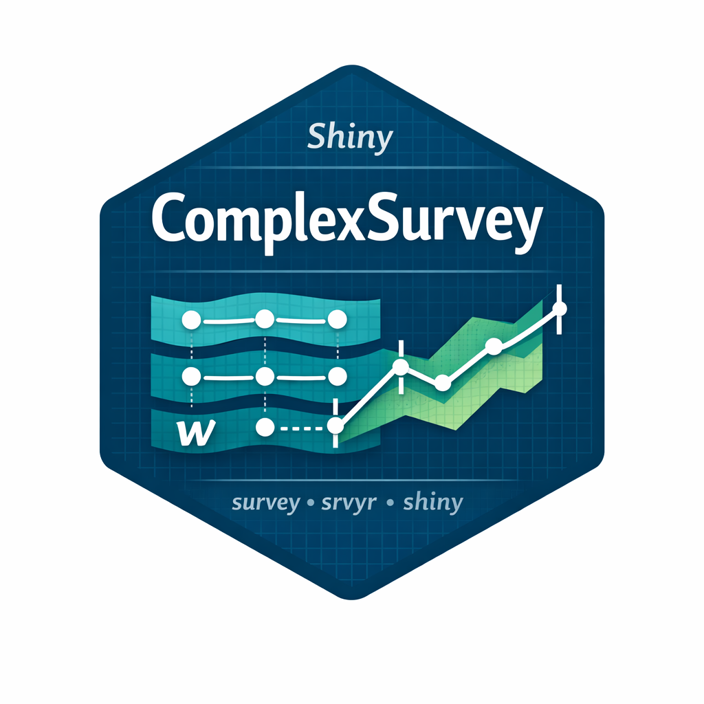

# ShinyComplexSurvey 

**ShinyComplexSurvey** es una aplicación web desarrollada en `R Shiny` para el
análisis estadístico de encuestas de muestreo complejo. Permite definir diseños
muestrales, estimar indicadores con corrección por diseño y visualizar resultados
con medidas de incertidumbre, todo sin necesidad de escribir código.

Está orientada a investigadores, estadísticos y analistas que trabajan con datos
provenientes de encuestas probabilísticas (encuestas nacionales, censos,
estudios epidemiológicos) y requieren estimaciones rigurosas que respeten la
estructura del diseño muestral.

---

## Módulos principales

### Datos
- Carga de archivos en formatos **CSV**, **RDS** y **XLSX**.
- Conjunto de datos de ejemplo integrado para exploración inmediata.
- Vista previa tabular interactiva con resumen de dimensiones y variables.

### Diseño muestral
- Soporte para tres tipos de diseño:
  - **Simple aleatorio (SRS)**
  - **Estratificado**
  - **Conglomerados / Multietápico**
- Configuración de variables de estrato, conglomerado, pesos de expansión y
  corrección de población finita (FPC).
- Generación automática del código R equivalente (`svydesign`).
- Diagnóstico del diseño construido.

### Estimación
- Estimadores disponibles: **media**, **total**, **proporción**, **razón** y
  **cuantiles**.
- Desglose por **dominios** (una o varias variables de clasificación).
- Marco teórico con formulación matemática (renderizado con MathJax).
- Tabla de resultados con error estándar, intervalo de confianza y coeficiente
  de variación (CV).
- Indicadores de calidad para evaluar la confiabilidad de las estimaciones.

---

## Interfaz

La aplicación cuenta con una interfaz de estilo empresarial diseñada para
entornos profesionales:

- **Barra de navegación** oscura (navy) con iconos por módulo.
- **Cards** con cabecera, separación visual y borde de acento en paneles laterales.
- **Cabeceras de página** con ícono descriptivo y subtítulo contextual.
- **Salida de código** en estilo terminal (fondo oscuro, tipografía monoespaciada).
- **Soporte multiidioma** (Español / English) desde la barra superior.
- Tipografía **Inter** con jerarquía tipográfica clara.

---

## Requisitos e instalación

`ShinyComplexSurvey` requiere **R >= 4.1.0**. Las dependencias del paquete
incluyen: `shiny`, `DT`, `srvyr`, `survey`, `dplyr`, `tibble`, `tidyr`,
`readr`, `readxl`, `haven`, `ggplot2`, `jsonlite`, entre otras.

La forma recomendada de instalar todas las dependencias es:

```r
install.packages("pak")
pak::pak(".")
```

---

## Ejecutar la aplicación

Una vez instalado el paquete, inicia la app con:

```r
ShinyComplexSurvey::ComplexSurvey_app()
```

---

## Estructura del paquete

```
R/
├── app_ui.R              # UI raíz (navbarPage + tema)
├── app_server.R          # Servidor raíz (i18n + orquestación)
├── mod_datos_*           # Módulo de carga de datos
├── mod_diseno_*          # Módulo de diseño muestral
├── mod_estimacion_*      # Módulo de estimación
├── design.R              # Lógica de construcción del diseño
├── estimate_survey.R     # Estimadores con corrección por diseño
├── generate_example_data.R
└── i18n.R                # Internacionalización
inst/
├── app/www/custom.css    # Tema visual enterprise
└── i18n/                 # Diccionarios ES / EN
```

---

## Autor

**Stalyn Guerrero Gómez** — [guerrerostalyn@gmail.com](mailto:guerrerostalyn@gmail.com)  
Licencia: GPL-3
