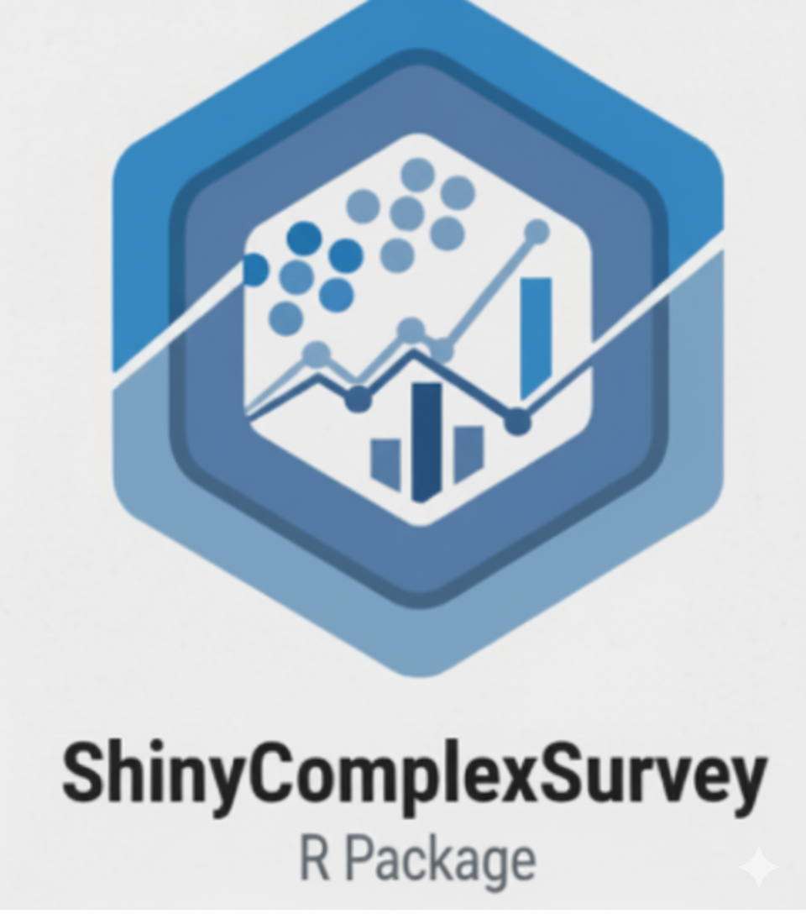

# ShinyComplexSurvey: Una aplicación Shiny para análisis de encuestas complejas 

**ShinyComplexSurvey** es una aplicación de `R Shiny` diseñada para simplificar el
análisis de datos de encuestas complejas. Permite a los usuarios explorar,
analizar y visualizar datos de encuestas probabilísticas de manera intuitiva y
sin necesidad de escribir código, manejando automáticamente características del
diseño de muestreo como la estratificación y los pesos.

Esta herramienta está orientada a investigadores, estudiantes y analistas que
trabajan con datos de encuestas complejas (por ejemplo, encuestas nacionales o
censos) y necesitan generar resultados descriptivos, numéricos y gráficos de
forma eficiente.

## 🚀 Características principales

- Carga y gestión de bases de datos de encuestas complejas.
- Definición del diseño muestral (estratos, conglomerados y pesos).
- Estimación de indicadores con errores estándar, intervalos de confianza y
  coeficientes de variación.
- Visualización gráfica interactiva:
  - Tablas dinámicas con filtrado y exportación.
  - Gráficos de barras, comparaciones y gráficos avanzados (modo `esquisse`).
- Descarga de resultados en formatos estándar (`.csv`, `.xlsx`).


### Desarrollo local

```r
# 1) Clona el repositorio
git clone <URL-DEL-REPO>

# 2) Instala dependencias principales
install.packages(c(
  "shiny", "dplyr", "tidyr", "DT", "glue", "plotly", "bslib",
  "shinyWidgets", "shinyjs", "shinydashboard", "shinythemes",
  "esquisse", "ggplot2", "readr", "writexl"
))

# 3) Carga el proyecto
setwd("ShinyComplexSurvey")
```

## 🧪 Ejemplo mínimo reproducible

El siguiente ejemplo crea una base sintética compatible con una encuesta
compleja (peso, estrato y conglomerado):

```r
set.seed(123)
encuesta_demo <- data.frame(
  id = 1:200,
  estrato = sample(c("Urbano", "Rural"), 200, replace = TRUE),
  conglomerado = sample(1:40, 200, replace = TRUE),
  peso = runif(200, min = 0.5, max = 3),
  ingreso = round(rlnorm(200, meanlog = 6.2, sdlog = 0.35), 2)
)

head(encuesta_demo)
```

Con este archivo puedes validar la carga de datos, selección de variables de
diseño y generación de salidas descriptivas dentro de la app.

## ▶️ Cómo lanzar la app exactamente

Actualmente este repositorio no incluye todavía un `app.R` en la raíz ni una
función exportada del paquete para iniciar la aplicación. El flujo esperado,
una vez incorporado el archivo de entrada, será uno de estos dos:

```r
# Si el proyecto usa app.R en la raíz
shiny::runApp(".")

# Si el proyecto usa una carpeta de app
shiny::runApp("app_estimacion")
```


